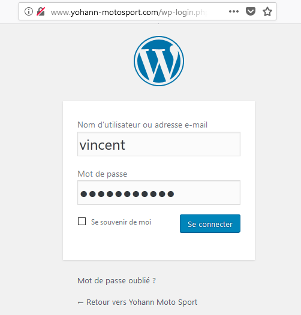
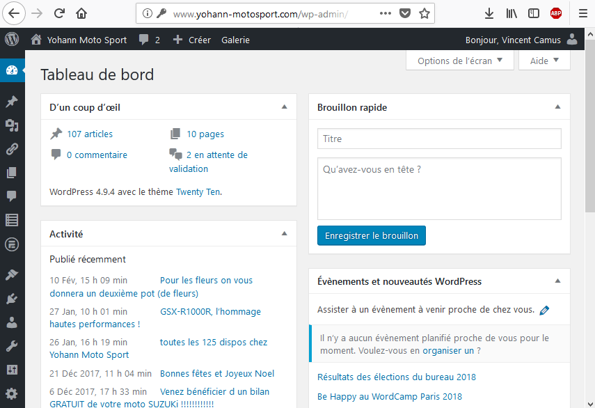
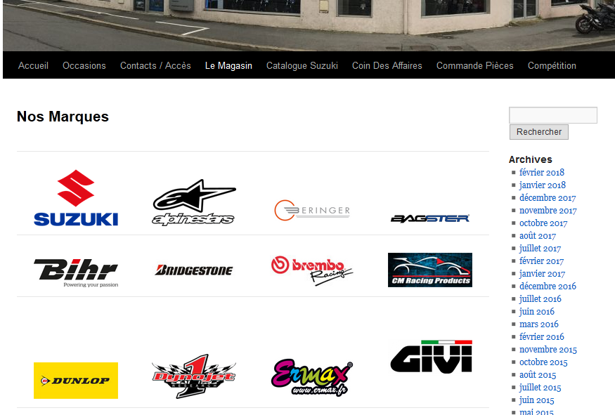
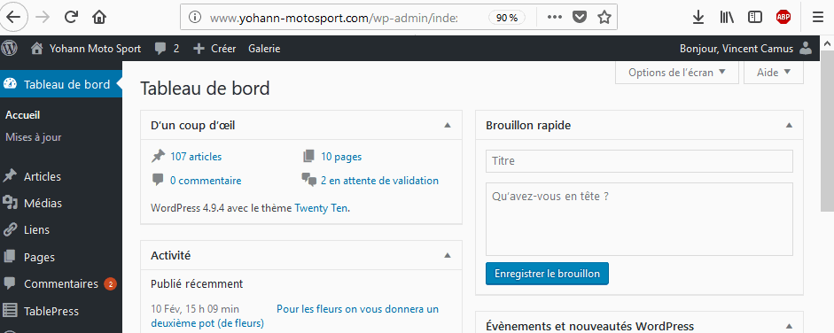
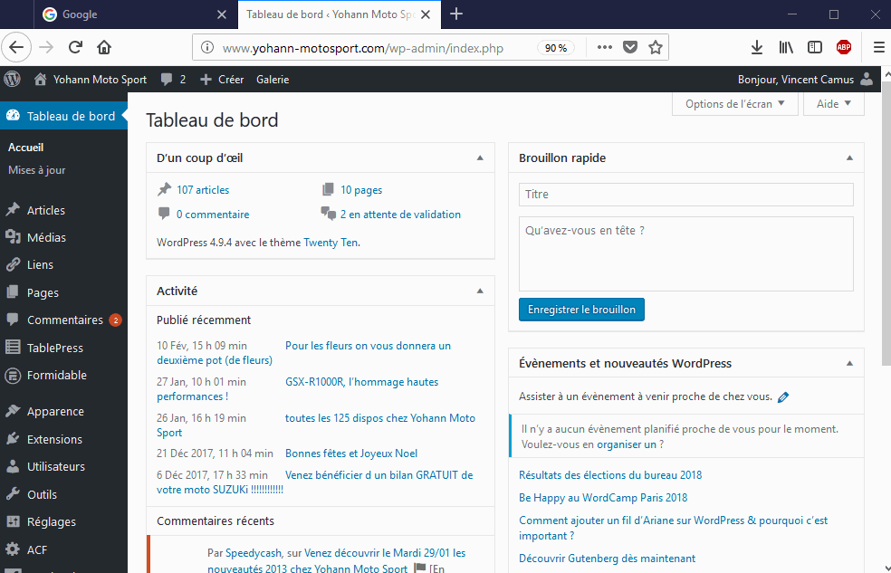

yms-userdocs
============

Documentation utilisateur du site web
[yohann-motosport.com](http://yohann-motosport.com).

Sommaire
--------

* [Connexion à l'interface d'administration](#connexion-à-linterface-dadministration)
* [Modification de la page **Nos Marques**](#modification-de-la-page-nos-marques)
    * [Trouver l'adresse d'un logo de marque](#trouver-ladresse-dun-logo-de-marque)

Connexion à l'interface d'administration
----------------------------------------

Pour accéder à l'interface d'administration, accéder au lien suivant:
```url
http://yohann-motosport.com/admin
```



Entrer le nom d'utilisateur et le mot de passe, c'est bon!



Modification de la page **Nos Marques**
-------------------------------------

Cette page affiche un tableau avec une case par marque. Chaque marque est
affichée par son logo. Cliquer sur le logo redirige vers la page internet de
la marque en question. Voici à quoi ressemble la page:



Pour la modifier, rendez-vous dans le tableau de bord d'administration, sur la
page `Apparence > Custom Javascript`:



Cette page contient un tableau avec:

* Une ligne par marque ;
* 3 colonnes:
    * Le nom de la marque ;
    * L'adresse du site web de la marque ;
    * L'adresse du logo à afficher.

**Exemple:**
```javascript
var brands = [
    ["Suzuki",      "http://www.suzuki-moto.com",   "http://.../Le-motos-logo-Suzuki.png" ],
    ["Alpinestar",  "http://www.alpinestars.com",  "https://...seeklogo.com.png" ],
    ["Beringer",    "http://www.beringer.fr",      "http://...logo_3.jpg" ],
    ["Bagster",     "http://www.bagster.fr",       "https://...0/LOGO-BAGSTER-GD.png" ],
    ["Bihr",        "https://www.bihr.eu/",        "https://...9/Logo-BIHR.png" ],
    ["Bridgestone", "http://www.bridgestone.fr",   "http://...ridgestone.jpg" ],
    ["Brembo",      "http://www.brembo.fr/",       "http://...rembo.jpg" ],
    ["CM-Racing",   "http://www.cm-racing.com/",   "http://...01/cmracing.jpg" ],
    ["Dunlop",      "http://www.dunlop.fr/",       "http://...1/dunlop.jpg" ],
    ["Dynojet",     "http://www.dynojet.com/",     "https://...ogo.com.png" ],
]
```

Ajouter une marque revient à copier-coller une ligne et à changer les valeurs
de la nouvelle ligne.

*A noter que l'ordre des lignes correspond à l'ordre des cases dans le tableau.*

### Trouver l'adresse d'un logo de marque

Pour trouver l'adresse d'un logo de marque, il faut:
* Chercher `"<MARQUE> logo"` sur Google image ;
* Cliquer sur un logo (cela ouvre un aperçu) ;
* Cliquer-droit sur l'aperçu et cliquer sur `"Copier l'adresse de l'image"` ;
* Coller l'adresse dans la troisième colonne.

**Exemple complet:**


